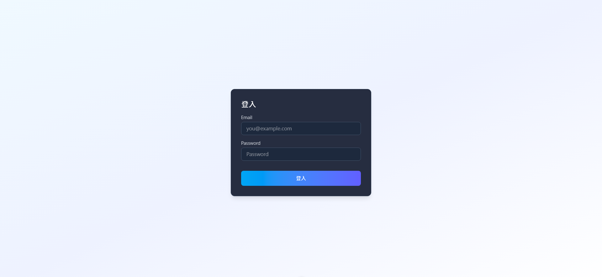
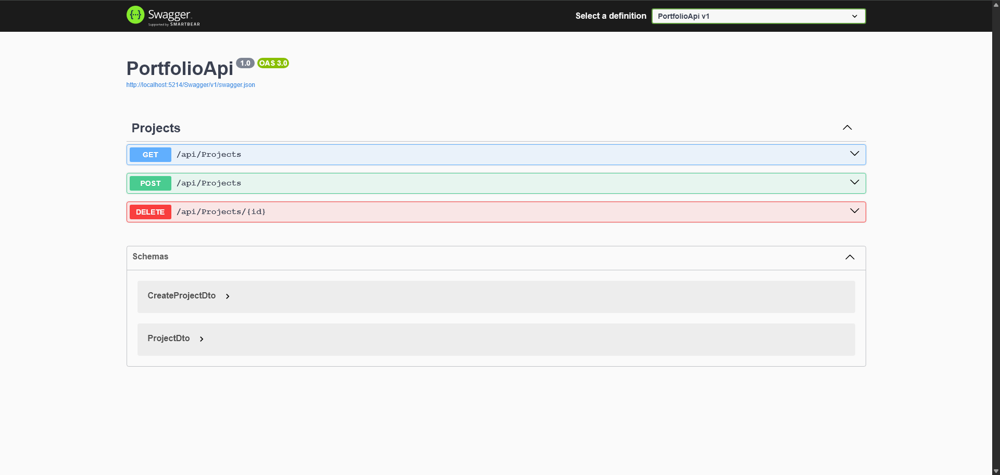

# 🚀 [MyPortfolio] - 個人全端作品集

> 一個整合現代化前端 (Vue 3) 與 穩健後端 (.NET 10 WebAPI) 的專案管理儀表板。

## 📖 專案簡介 (About)

這是我在學習全端開發過程中的實戰作品。目標是建立一個能夠管理專案進度、展示數據的儀表板系統。
透過這個專案，我實踐了前後端分離架構，並解決了 CORS、資料庫遷移與 RESTful API 設計等挑戰。

### ✨ 功能亮點 (Features)
- **前後端分離**：使用 Vue 3 (Script Setup) 與 .NET 8 Web API 進行開發。
- **資料庫整合**：使用 Entity Framework Core 操作 SQLite 資料庫 (Code First)。
- **RESTful API**：遵循標準 HTTP 方法設計 API (GET, POST, PUT, DELETE)。
- **互動式 UI**：使用 Axios 串接資料，並實現即時載入狀態 (Loading State)。
- **API 文件**：整合 Swagger UI 自動生成介面說明。

---

## 🛠️ 技術堆疊 (Tech Stack)

| 領域 | 技術 / 工具 |
| :--- | :--- |
| **Frontend** | Vue 3, Vite, Tailwind CSS, Axios |
| **Backend** | .NET 8, C#, Entity Framework Core |
| **Database** | SQLite (開發環境) |
| **DevOps/Tools** | Git, GitHub, Swagger, Postman |

---

## 📸 畫面展示 (Screenshots)

### 登入頁面

### API 文件 (Swagger)

---
 